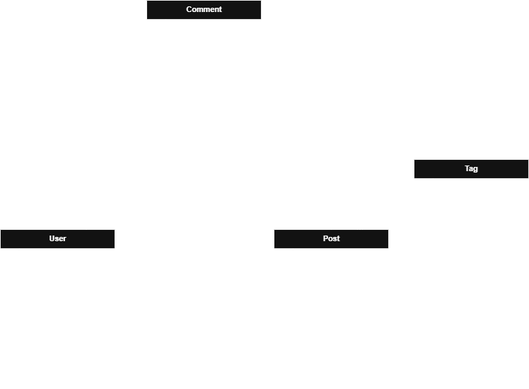

# Database Design for DevShare Lite

This document provides a detailed overview of the database schema for the **DevShare Lite** project.  
We use a **relational database model**, implemented with **PostgreSQL**, chosen for its robustness, reliability, and powerful features for handling complex queries and relationships.

# Overall database design 

### 1. User Table
This table stores all user account and profile information, extending Django's built-in `AbstractUser`. It is the central entity for authentication and content authorship.

-   **Primary Key (PK):** `id` (BigAutoField) - A unique, auto-incrementing identifier for each user.
-   **Fields:**
    -   `username`: `CharField(100)` - The user's unique, public-facing name.
    -   `email`: `EmailField` - The user's unique email address, used for login.
    -   `bio`: `CharField(600)` - A short biography that the user can write about themselves.
    -   `profile_image`: `ImageField` - A path to the user's uploaded profile picture. This field is optional (`NULL` allowed).
    -   `...(other default Django User fields)`: Includes fields like `password` (hashed), `is_active`, `date_joined`, etc.

### 2. Post Table
This table stores all articles created by users. It is the main content entity of the application.

-   **Primary Key (PK):** `id` (BigAutoField) - A unique, auto-incrementing identifier for each post.
-   **Fields:**
    -   `title`: `CharField(300)` - The title of the post.
    -   `content`: `TextField` - The main body of the post, which can be extensive and supports Markdown formatting.
    -   `status`: `CharField(2)` - The current state of the post, such as 'DR' (Draft) or 'PB' (Published).
    -   `created_at`: `DateTimeField` - A timestamp automatically set when the post is created.
    -   `updated_at`: `DateTimeField` - A timestamp automatically updated every time the post is saved.
-   **Foreign Key (FK):**
    -   `author`: A reference to the `id` of the `User` who created the post.

### 3. Comment Table
This table stores all comments and supports a nested structure for replies.

-   **Primary Key (PK):** `id` (BigAutoField) - A unique, auto-incrementing identifier for each comment.
-   **Fields:**
    -   `content`: `TextField` - The text content of the comment.
    -   `created_at`: `DateTimeField` - Timestamp of when the comment was created.
    -   `updated_at`: `DateTimeField` - Timestamp of the last update.
-   **Foreign Keys (FK):**
    -   `commenter`: A reference to the `id` of the `User` who wrote the comment.
    -   `post`: A reference to the `id` of the `Post` the comment belongs to.
    -   `parent`: A self-referencing key pointing to the `id` of another `Comment`. This field is optional (`NULL` allowed). If `NULL`, it is a top-level comment. If it contains an ID, it is a reply to that comment.

### 4. Tag Table
A simple table to store unique tags, used for categorizing and discovering posts.

-   **Primary Key (PK):** `id` (BigAutoField) - A unique, auto-incrementing identifier for each tag.
-   **Fields:**
    -   `name`: `CharField(150)` - The unique name of the tag (e.g., "react", "django").

---

## Relationships

-   **User ↔ Post (`One-to-Many`)**: A single user can be the `author` of many posts. This is a one-to-many relationship, defined by the `author` foreign key in the `Post` table.

-   **User ↔ Comment (`One-to-Many`)**: A single user can be the `commenter` on many comments. This is defined by the `commenter` foreign key in the `Comment` table.

-   **Post ↔ Comment (`One-to-Many`)**: A single post can have many comments. This is defined by the `post` foreign key in the `Comment` table. If a post is deleted, all its associated comments will also be deleted (`on_delete=CASCADE`).

-   **Post ↔ Tag (`Many-to-Many`)**: A single post can have multiple tags, and a single tag can be applied to multiple posts. Django automatically creates a hidden join table (e.g., `posts_post_tags`) to manage this relationship.

-   **Comment ↔ Comment (`One-to-Many, Self-referencing`)**: The `parent` foreign key in the `Comment` table points to `Comment`, creating a hierarchical structure for replies. This allows for nested discussions.
