# DevShare Lite - Features, Challenges, and Future Directions

This document provides a comprehensive overview of the features implemented in DevShare Lite, the technical challenges encountered during development, the solutions applied, and the future roadmap for the project.

---

## 🚀 1. Main Features

### 1.1. User Authentication System
A secure and robust authentication flow is the foundation of the application, managed by Django's `dj-rest-auth` and `django-allauth` on the backend and React Context API on the frontend.

-   **User Registration:** New users can create an account using a username, email, and password. The backend ensures that both username and email are unique across the system.
-   **Two Login Methods:** The system supports logging in with either a **username** or an **email address**, providing a flexible user experience. The frontend intelligently detects the input type and sends the correct payload to the API.
-   **JWT-Powered Sessions:** User sessions are managed using JSON Web Tokens (JWT). Upon successful login, the client receives an `access_token` (short-lived) and a `refresh_token` (long-lived), which are securely stored.
-   **Automatic Token Refresh:** An `axios` response interceptor was implemented to automatically handle expired `access_token`s. It silently uses the `refresh_token` to request a new `access_token` without interrupting the user's session, ensuring a seamless experience.
-   **Secure Logout:** The logout process invalidates the `refresh_token` on the backend by adding it to a blacklist (`simplejwt-token-blacklist`) and clears all authentication data from the client's `localStorage`.
-   **Global Auth State:** A central `AuthContext` provides authentication status (`user`, `isAuthLoading`) to all components, allowing the UI (like the Header) to dynamically adapt based on the user's login state.

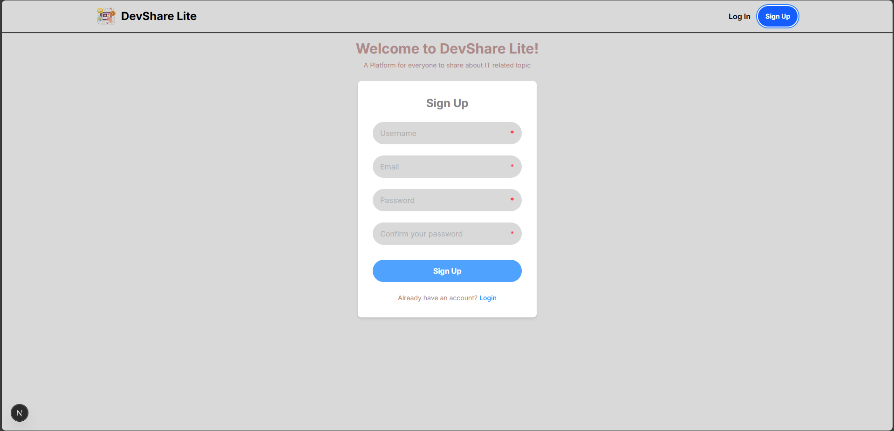
**Signup Page** 

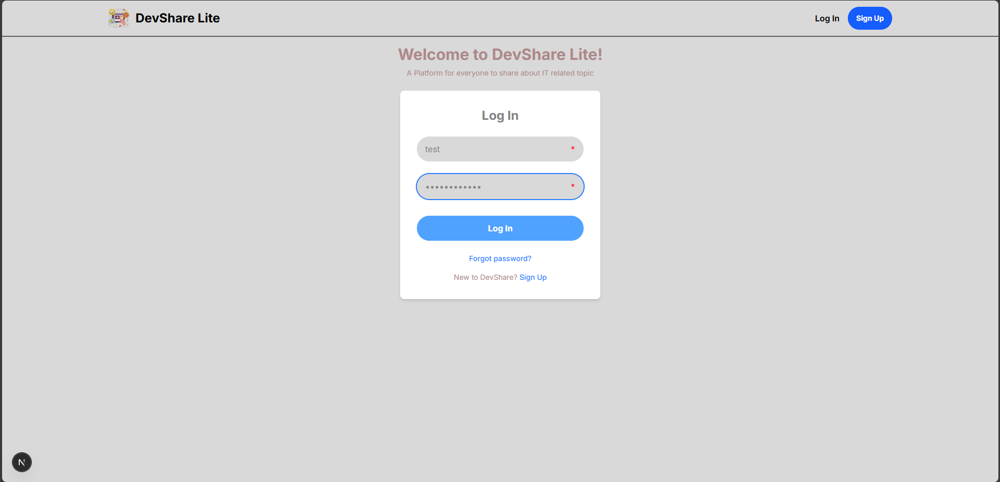
**Login Page** 

### 1.2. Post Management
The core content feature allows users to create, manage, and share their knowledge through articles.
-  **Homepage:** Provides ‘infinity scroll’, similar to others social media, can click on desired post for more details and comments

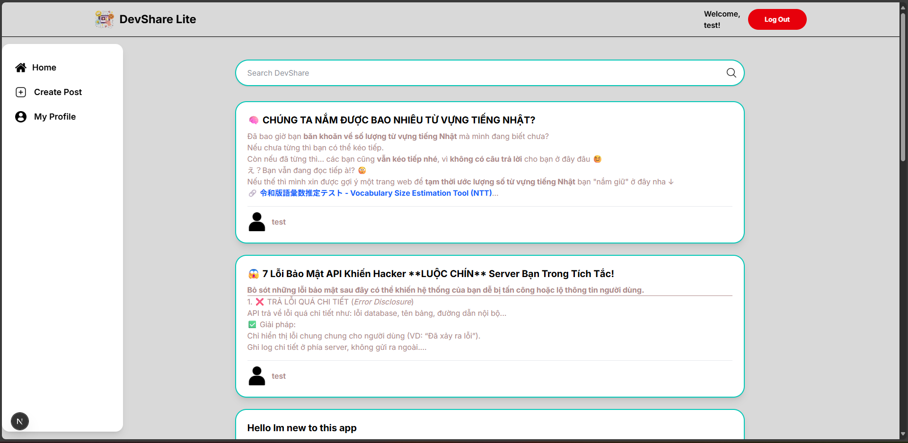
**Homepage**

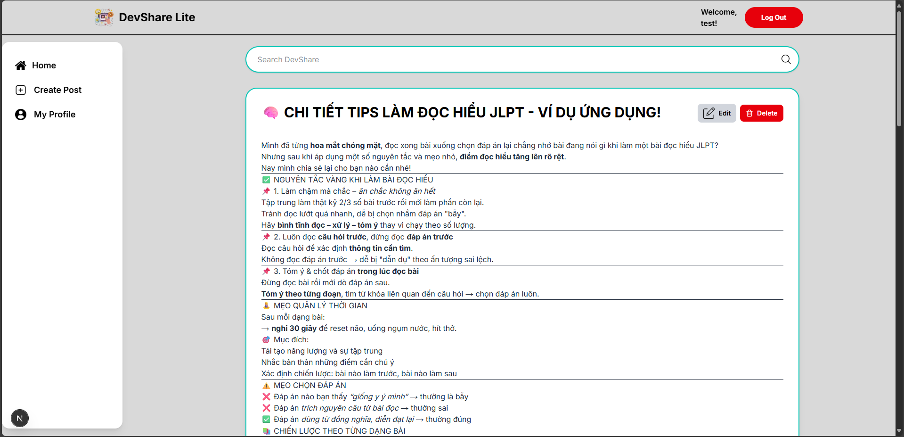
**Post Details**

-   **Content Creation:** Users can create posts with a title, tags, and a content body that supports **Markdown**, rendered on the frontend with `react-markdown`.
-   **Draft & Publish Workflow:**
    -   When creating a post, users can choose to either **"Save Draft"** or **"Publish"** it directly.
    -   Drafts are only visible to the author (in their profile page) and can be edited further.
    -   The "Edit Post" page for a draft includes a "Publish" button to make the post public.

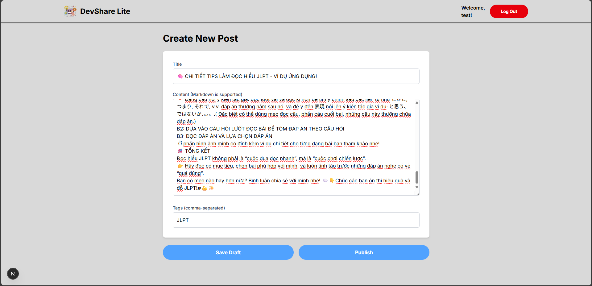
**Create Post Page**

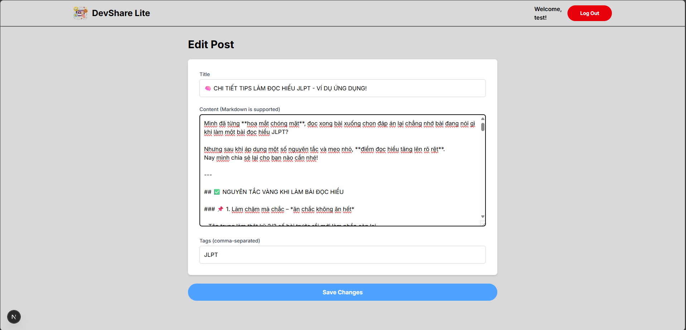
**Edit Post**

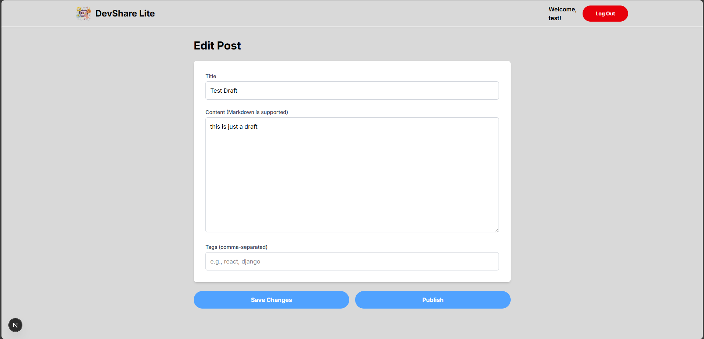
**Edit Draft**

-   **Authorization**: Post editing and deletion are strictly controlled. The backend uses a custom `IsAuthorOrReadOnly` permission class, and the frontend conditionally renders "Edit" and "Delete" buttons only if the logged-in user is the post's author.
-   **Deletion with Confirmation**: A browser confirmation dialog (`window.confirm`) is used before deleting a post to prevent accidental data loss.

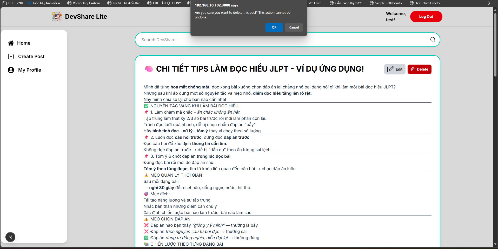

### 1.3. Nested Commenting System
An interactive, two-level nested comment system allows for structured discussions on posts.

-   **Create Comments & Replies:** Authenticated users can post top-level comments or reply directly to other comments.
-   **Optimistic UI Updates:** When a user submits a comment, it appears **instantly** on their screen. The API call is processed in the background, and the UI is then silently synchronized with the authoritative data from the server using `router.refresh()`, providing a fast and seamless user experience.
-   **Defensive Rendering:** The comment components are designed to handle cases where a commenter's account has been deleted, preventing the UI from crashing by displaying "Deleted User" instead.

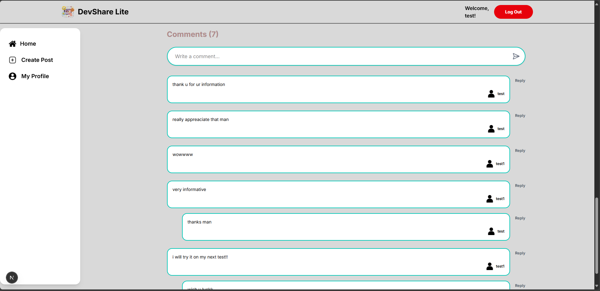
**Comment Section**

### 1.4. Search & Discovery
A powerful search feature helps users find relevant content across the platform.

-   **Backend-Powered Search**: The search functionality is handled by the backend using `django-filter`'s `SearchFilter`. It searches across post titles, content, author usernames, and tags.
-   **Dedicated Search Page**: Submitting a query in the search bar navigates the user to a dedicated `/search?q=...` page, which fetches and displays a list of matching posts.

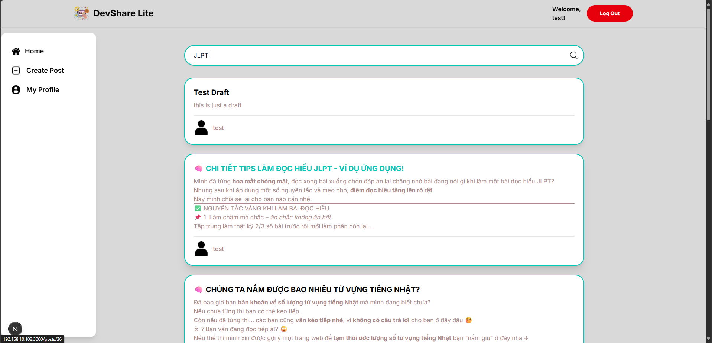
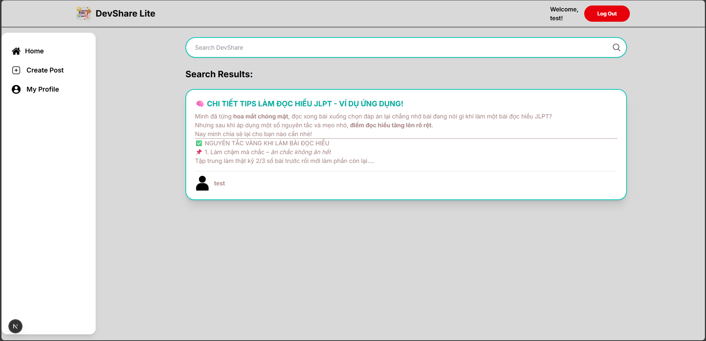
**Search Result**

### 1.5. User Profile Page
A personal space for users to manage their information and content.

-   **Profile Information**: Displays the user's profile picture, username, email, and bio.
-   **Inline Profile Editing**: Users can edit their bio and upload a new profile picture directly on the page. Changes are saved via a `PATCH` request to the API.
-   **Content Organization**: The profile page clearly separates the user's content into two sections: **"My Drafts"** and **"My Published Posts"**, allowing for easy management of their articles.
-   **Contextual Links**: Clicking on a draft navigates to the edit page (`/posts/edit/[id]`), while clicking on a published post navigates to the public view page (`/posts/[id]`).

*   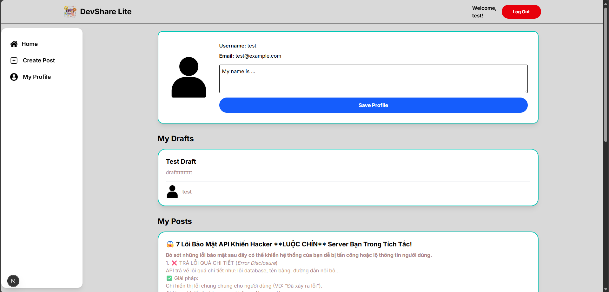
**User Profile**
---

## 💡 Advanced Features Implemented

-   **Automatic Token Refresh:** Implemented a robust `axios` interceptor to handle JWT expiration silently, preventing session interruptions.
---

## 🚨 Challenges Faced & Solutions

1.  **Challenge: Initial API Setup & Incorrect JWT Response Format**
    -   **Problem**: Early in the development, authenticated requests were consistently failing. Debugging revealed that the Django backend, despite having `dj-rest-auth` and `simple-jwt` installed, was not returning the `access_token` and `refresh_token` in the JSON body of the login response as expected.
    -   **Solution**: This was traced back to a misconfiguration in `settings.py`. The `REST_AUTH` setting was configured to use JWT cookies (`JWT_AUTH_COOKIE`) by default. The solution was to explicitly disable this behavior by **commenting out or removing the cookie-related settings** and adding `TOKEN_MODEL = None` to signal that the built-in DRF token model was not being used. This forced `dj-rest-auth` to fall back to its standard behavior of returning tokens directly in the JSON response body, which the frontend was designed to handle.

2.  **Challenge: Next.js Hydration Error (`<a>` in `<a>`)**
    -   **Problem**: A core feature was to make the entire post clickable, leading to the post's detail page. This was initially implemented by wrapping the `Post` component in a single Next.js `<Link>` component. However, this caused a fatal hydration error whenever the post's Markdown content itself contained a link, resulting in an invalid nested `<a>` tag structure.
    -   **Solution**: The component's architecture was refactored to avoid direct nesting. The parent `Post` `div` was given `position: relative`. A "ghost" `<Link>` component was then placed inside it, styled with `position: absolute` and `inset-0` to create an invisible, clickable overlay that covers the entire post box. The actual content, including the `react-markdown` component, was given a higher `z-index` to ensure it sits "on top" of this overlay. This solution completely resolves the invalid HTML structure, allowing both the entire post and any links within the Markdown to be clickable independently.

3.  **Challenge: 401 Unauthorized Errors on Authenticated Actions**
    -   **Problem**: After logging in, creating a new post would fail with a 401 error, indicating the API request was not sending the JWT token.
    -   **Solution**: Implemented an **`axios` request interceptor**. This central piece of logic automatically attaches the `Authorization: Bearer <token>` header to every outgoing API request (except for login/register), ensuring all protected endpoints receive the necessary credentials.

4.  **Challenge: Persistent Data Mismatches Between Client and Server (Type Coercion)**
    -   **Problem**: A recurring and difficult-to-debug issue was that an author could delete their post but not edit it. Console logging revealed that `user.id` (from `AuthContext`, usually a `number`) did not strictly equal (`===`) `post.author.id` (from API props, sometimes a `string`). This type mismatch caused the authorization check to fail silently.
    -   **Solution**: We first applied a quick fix by using loose equality (==) to handle type mismatches like "1" vs 1. Then, to solve the issue properly, we created a sanitizePost function on the server to convert all IDs to numbers before sending them to the client. This ensures consistent data types across the app and helps prevent similar bugs in the future.

---

## 🚦 Known Limitations

-   The application currently does not provide function to **reset password** (Forgot Password). Will be added in the future.
-   The application does not currently feature real-time updates (e.g., new comments appearing without a refresh). It relies on `router.refresh()` for data synchronization.
-   The commenting system is limited to two levels of nesting to maintain UI simplicity.
-   The autosave function is not available. Replaced by a simplified solution: using the "Save Draft" button to ensure robust and predictable behavior.

## 🌟 Future Directions

-   **Real-time Functionality**: Integrate live notifications and instant comment updates.
-   **Enhanced User Profiles**: Add social features like "followers/following" and a more detailed activity feed.
-   **Advanced Search**: Implement more powerful search filters, such as filtering by specific tags or sorting by date/popularity.
-   **Content Moderation**: Build tools for administrators and moderators to manage content and users.
-   **Enhance Interaction between Users**: Add features such as like, share, and a chat system to improve communication between users.
